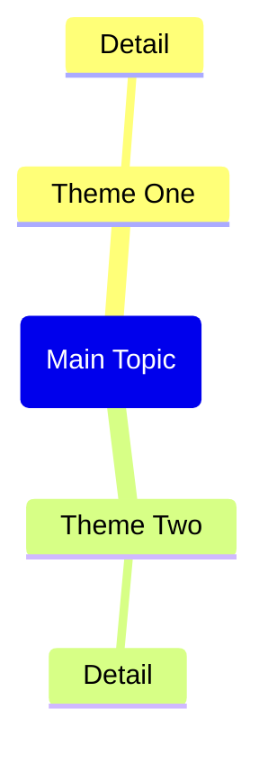

# 目标
围绕“剪辑网页”这一类任务，稳定执行原 prompt 想表达的核心能力，并把零散命令沉淀为可复用的 skill。

## 适用场景
- 当需要基于网页上下文生成结构固定的 Obsidian 剪藏笔记，并补全摘要、要点、思维导图和引用内容时使用。
- 适合需要复用同一类提示词、同时希望 agent 按固定结构稳定输出结果的场景。

## 输入要求
- 网页上下文，例如 Web Viewer、网页剪报或剪辑结果

## 输出要求
- 最终回复只输出结果本体，不额外附加解释、前言或注释
- 若要求生成 Mermaid，必须只输出合法的 Mermaid 代码块
- 输出需要兼容 Obsidian 使用场景和语法约束

## 执行步骤
1. 先识别输入材料、上下文来源和隐含占位符，明确本次处理对象。
2. 提取原 prompt 的核心任务、结构约束和禁止项，再将它们转写为稳定的执行顺序。
3. 在生成图表前先判断最合适的 Mermaid 图类型，再按语法限制产出代码块。
4. 按 Obsidian 结构要求组织元数据、摘要、正文、Callout、双链或附加区块。
5. 输出前做一次格式自检，确保最终回复中没有多余解释。
6. 在最终输出前逐项校验格式、语气、长度和保留项，避免漏掉原 prompt 的关键约束。

## 保留约束
以下原始约束在执行时必须继续遵守：

```markdown
根据上下文中提供的网页内容（来自Obsidian Web Clipper或Web Viewer），生成完整的Obsidian笔记。

重要提示：如果没有找到网页上下文，请提醒用户：
1.在Web Viewer中打开网页（或使用@选择Web选项卡）
2.或者打开黑曜石剪报夹的纸条
3.然后再次使用此命令

生成具有以下确切结构的音符：

---
title: "<page title>"
source: "<page url>"
description: "<brief description>"
tags:
  - "clippings"
---

## Summary

<Brief 2-3 paragraph summary of the page content>

## Key Takeaways

<List 5-8 key takeaways as bullet points>

## Mindmap

CRITICAL Mermaid mindmap syntax rules - MUST follow exactly:
- Root node format: root(Topic Name) - use round brackets, NO double brackets
- Child nodes: just plain text, no brackets needed
- Do NOT use quotes, parentheses, brackets, or any special characters in text
- Keep all node text short and simple - max 3-4 words per node



## Notable Quotes

<List 3-5 notable quotes from the content, if any>

Return only the markdown content without any explanations or comments.
```

## 注意事项
- 原 prompt 禁止额外解释时，不能附带说明、免责声明或过程暴露。
- Mermaid 场景优先保证语法正确，其次再考虑节点命名美观。
- Obsidian 场景要避免使用会破坏前置属性区或 Callout 解析的写法。
