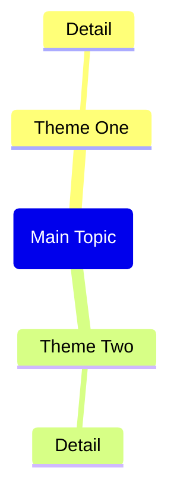

根据上下文中提供的网页内容（来自Obsidian Web Clipper或Web Viewer），生成完整的Obsidian笔记。

重要提示：如果没有找到网页上下文，请提醒用户：
1.在Web Viewer中打开网页（或使用@选择Web选项卡）
2.或者打开黑曜石剪报夹的纸条
3.然后再次使用此命令

生成具有以下确切结构的音符：

---
title: "<page title>"
source: "<page url>"
description: "<brief description>"
tags:
  - "clippings"
---

## Summary

<Brief 2-3 paragraph summary of the page content>

## Key Takeaways

<List 5-8 key takeaways as bullet points>

## Mindmap

CRITICAL Mermaid mindmap syntax rules - MUST follow exactly:
- Root node format: root(Topic Name) - use round brackets, NO double brackets
- Child nodes: just plain text, no brackets needed
- Do NOT use quotes, parentheses, brackets, or any special characters in text
- Keep all node text short and simple - max 3-4 words per node

## Notable Quotes

<List 3-5 notable quotes from the content, if any>

Return only the markdown content without any explanations or comments.